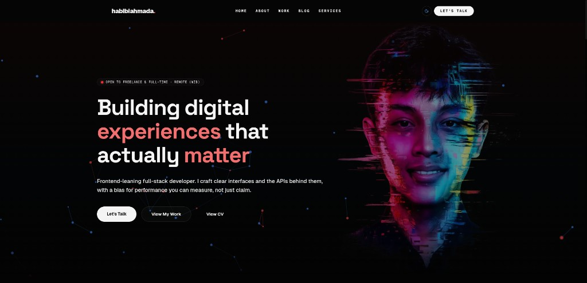

# Portfolio — Habibi Ahmad Aziz

Personal portfolio and blog for **Habibi Ahmad Aziz**, a web developer based in Karawang, Indonesia.

**Live site:** [https://www.habibiahmada.dev](https://www.habibiahmada.dev)



## About this project

This repository powers my public portfolio: projects, certificates, collaborators, services, an admin panel for content management, and a blog with optional agent-assisted publishing.

| Area | Description |
|------|-------------|
| Public site | Marketing pages (home, about, projects, blog) |
| Admin panel | Authenticated CRUD for portfolio content |
| Blog | Markdown articles with reactions, comments, and review workflow |
| Agent API | `POST /api/agent/blog` for automated daily posts (Bearer token) |

## Tech stack

| Layer | Technology |
|-------|------------|
| Framework | Next.js 16 (App Router) |
| UI | React 19, Tailwind CSS 4, Base UI / shadcn-style components |
| Motion | Framer Motion, GSAP, custom canvas visuals |
| Data & auth | Supabase (PostgreSQL, Auth, Storage) |
| Hosting | Vercel (production deploys from `main`) |
| Package manager | Bun |

## Getting started

### Prerequisites

- Node.js 22+ or Bun 1.3+
- A Supabase project with the schema described in [docs/data-and-hosting.md](./docs/data-and-hosting.md)

### Setup

```bash
bun install
cp .env.example .env.local
# Fill in Supabase keys, admin emails, and optional agent token — see .env.example

bun run dev
# http://localhost:3000
```

### Scripts

| Command | Purpose |
|---------|---------|
| `bun run dev` | Development server (Turbopack) |
| `bun run build` | Production build |
| `bun run start` | Serve production build |
| `bun run lint` | ESLint |

## Documentation

All developer docs in this repo are written in **English**. Start with [docs/README.md](./docs/README.md) for the full index.

| Doc | Purpose |
|-----|---------|
| [architecture.md](./docs/architecture.md) | Folder layout, request flows, stack |
| [development.md](./docs/development.md) | Local setup, conventions, testing |
| [data-and-hosting.md](./docs/data-and-hosting.md) | Database schema, env vars, Vercel/Supabase |
| [SECURITY.md](./SECURITY.md) | Auth, admin whitelist, security headers |
| [AGENTS.md](./AGENTS.md) | Entry map for coding agents |

## Environment variables

Copy `.env.example` to `.env.local` and fill in your values. **Never commit `.env.local`.**

Required variables include Supabase URL/keys, `ADMIN_ALLOWED_EMAILS`, and `NEXT_PUBLIC_SITE_URL`. See `.env.example` for the full list and descriptions.

## Security

- Admin access is restricted to emails in `ADMIN_ALLOWED_EMAILS`.
- The Supabase service role key is server-only; never expose it to the browser.
- Rotate `AGENT_BLOG_TOKEN` if the agent publishing secret is compromised.
- Details: [SECURITY.md](./SECURITY.md)

## License

Private project — all rights reserved.

---

## Contact

Open to freelance and full-time collaboration (remote, WIB).

- **Email:** [contact@habibiahmada.dev](mailto:contact@habibiahmada.dev)
- **LinkedIn:** [linkedin.com/in/habibiahmada](https://linkedin.com/in/habibiahmada)
